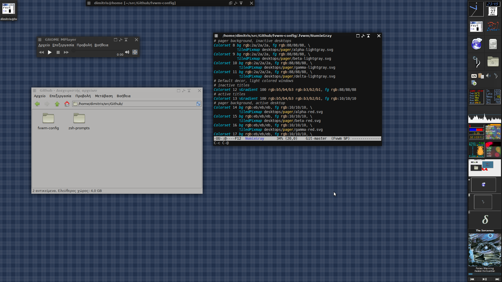
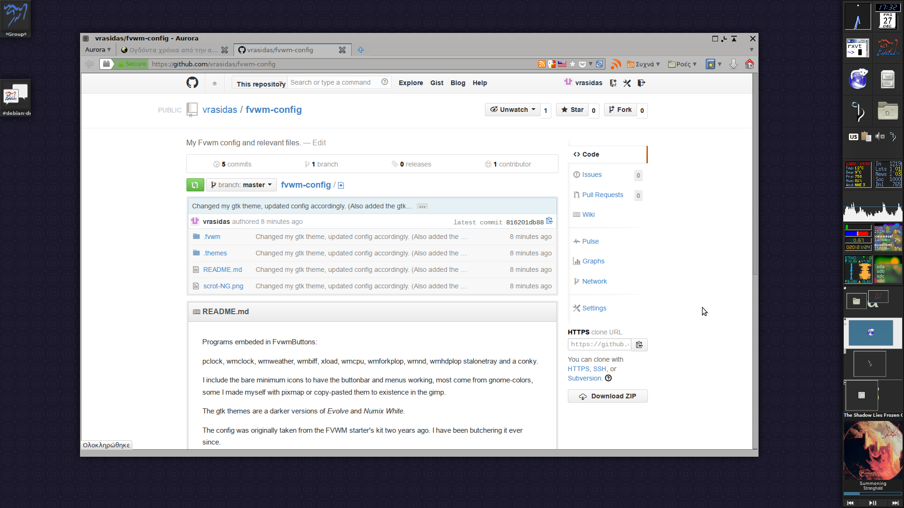

Programs embeded in FvwmButtons:

pclock, wmclock, wmweather, wmbiff, xload, wmcpu, wmforkplop, wmnd, wmhdplop
stalonetray and a conky.

I include the bare minimum icons to have the buttonbar and menus working, most
come from gnome-colors, some I made myself with pixmap or copy-pasted them
to existence in the gimp.

The gtk themes are a darker versions of *Evolve* and *Numix White*.

The config was originally taken from the FVWM starter's kit two years ago.
I have been butchering it ever since.

screenshots of the Evolve-Grayer version are at http://imgur.com/a/PCm9D

